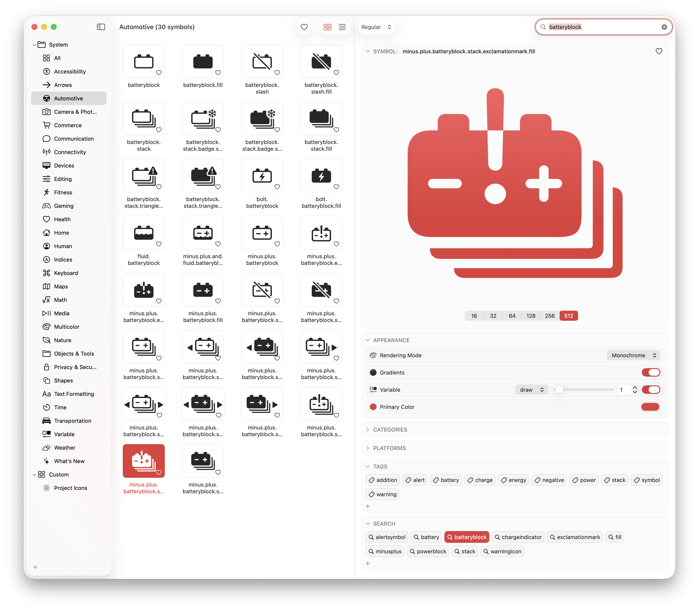
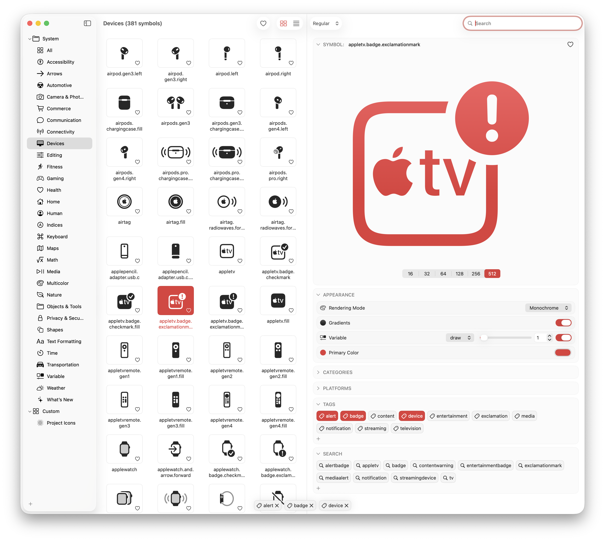
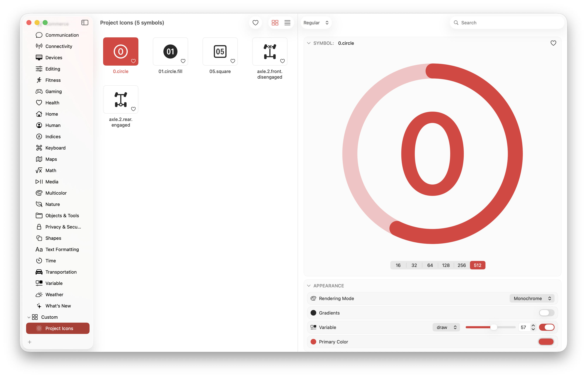
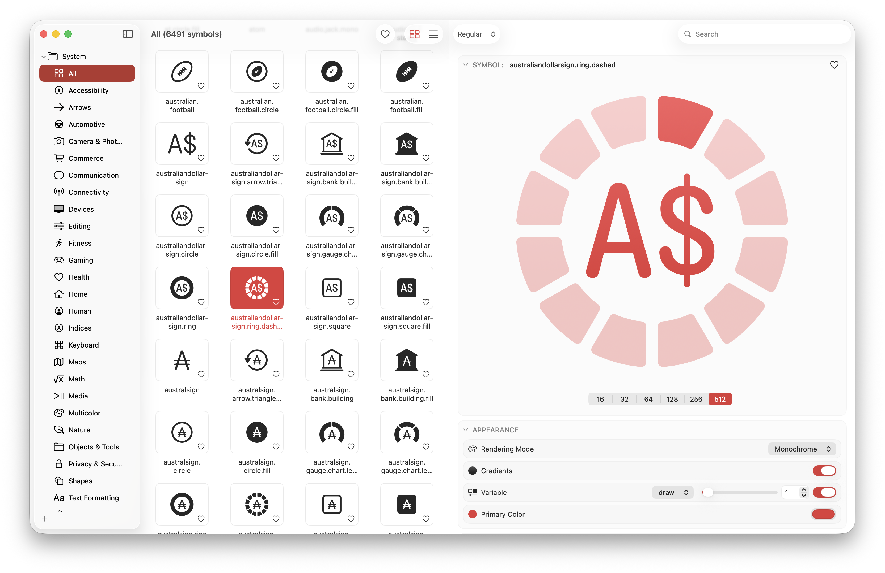

# 📚 Docs (1.0)

## 🔍 Smarter Search

The search in SF Symbols Lite goes beyond the original app.  
You can:

- Add your own **keywords** to improve symbol discovery.
- Edit or remove existing keywords at any time.
- Combine multiple keywords in a single search.

This means that if Apple didn’t label a symbol the way you remember it, you can fix that for your workflow.

<Tip><b>Example:</b> Add the keyword “trash” to “bin” so it appears when searching for either term.</Tip>

---

## 🏷️ Custom Tags

Tags let you organise symbols by themes, projects, or personal categories.

- You can assign multiple tags to any symbol.
- Tags are instantly searchable.
- Editing or deleting tags updates all linked symbols automatically.

<Tip><b>Example:</b> Create tags like “UI”, “Navigation”, or “System” to group symbols by use case.</Tip>

---

## 📂 Personal Categories

Unlike tags, categories appear in the sidebar and act as symbol collections.

- You can create and rename categories freely.
- Only custom categories can be deleted, so system ones stay safe.
- Categories help group related symbols visually for fast browsing.

<Tip><b>Example:</b> Build a category named “Project Icons” to collect all symbols you use in your app.</Tip>

---

## 🖼️ Enhanced Preview Rendering

Previewing symbols in multiple sizes makes design inspection easier.  
SF Symbols Lite allows you to view symbols at:
`16, 32, 64, 128, 256, and 512 px`.

- All previews use high-quality rendering.
- Sizes update instantly when switched.
- Perfect for comparing symbol legibility at different scales.

---

_Made with ❤️ in Swift by [Rui Aureliano](https://github.com/ruiaureliano)_
